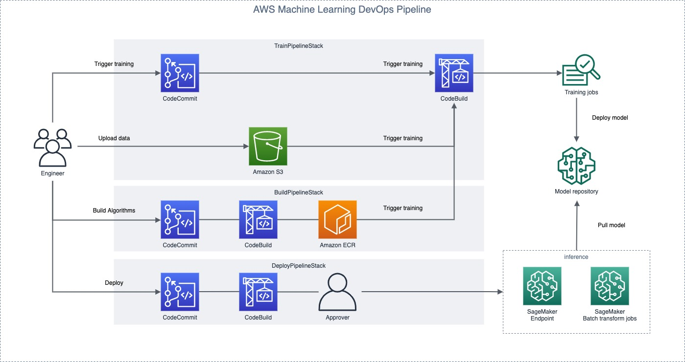

# AWS CDK of SageMaker MLOps Build, Train and Deploy your own container

## Introduction

This’s a sample solution to build a deployment pipeline for Amazon SageMaker. For the complex execution process of machine learning, fast and simple model training can be realized through automation, and the ML code can be quickly updated to meet the demand.

This solution provides as deployment by creating an Amazon SageMaker Endpoint for real-time inference.

## Architecture and Implementation
###  Architecture Diagram

###  Components Details
  - [**AWS CloudFormation**](https://aws.amazon.com/cloudformation/) – This solution uses the CloudFormation Template language, in either YAML or JSON, to create each resource.
  - [**AWS CodeCommit**](https://aws.amazon.com/codecommit/) – This solution uses CodeCommit source code version control.
  - [**AWS CodeBuild**](https://aws.amazon.com/codebuild/) – This solution uses CodeBuild to build the source code from CodeCommit
  - [**AWS CodePipeline**](https://aws.amazon.com/codepipeline/) – CodePipeline has various stages defined in CloudFormation which step through which actions must be taken in which order to go from source code to creation of the production endpoint. 
  - [**AWS SageMaker**](https://aws.amazon.com/sagemaker/) – This solution uses SageMaker to train the model to be used and host the model at an endpoint, where it can be accessed via HTTP/HTTPS requests
  - [**AWS IAM**](https://aws.amazon.com/iam/) – Separate Identity and Access Management (IAM) Roles are created for the pipeline, CodeBuild, and CloudFormation.
  - [**AWS SNS**](https://aws.amazon.com/sns/) – This solution uses a Simple Notification Service (SNS) Topic in order to approve movement into production after testing.
  - [**AWS S3**](https://aws.amazon.com/s3/) – Artifacts created throughout the pipeline as well as the data for the model is stored in an Simple Storage Service (S3) Bucket.
