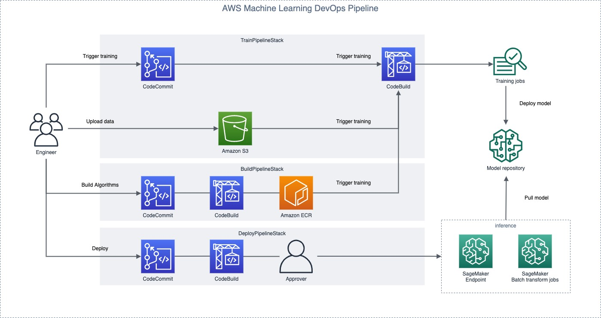
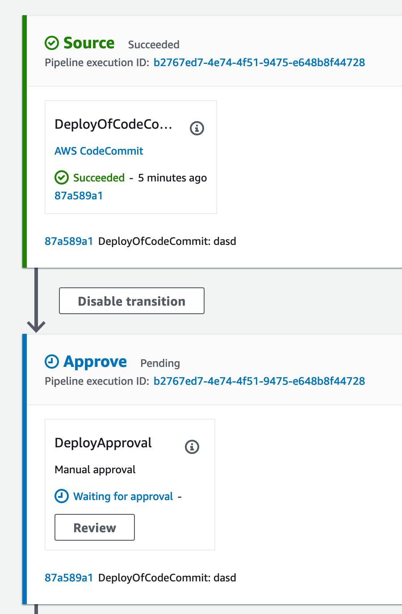

# AWS CDK of SageMaker MLOps Build, Train and Deploy your own container

## Introduction

This’s a sample solution to build a deployment pipeline for Amazon SageMaker. For the complex execution process of machine learning, fast and simple model training can be realized through automation, and the ML code can be quickly updated to meet the demand.

This solution provides as deployment by creating an Amazon SageMaker Endpoint for real-time inference.

## Architecture and Implementation
###  Architecture Diagram


- `BuildPipelineStack`: This stack for algorithm build contains the deployment of [AWS CodeCommit][CodeCommit], [AWS CodeBuild][CodeBuild], [AWS CodePipeline][CodePipeline], [Amazon SNS][SNS] and [Amazon ECR][ECR].
- `TrainPipelineStack`: This stack fo training jobs contains the deployment of [AWS CodeCommit][CodeCommit], [AWS CodeBuild][CodeBuild], [AWS CodePipeline][CodePipeline], [Amazon SNS][SNS] and [Amazon S3][S3].
- `DeployPipelineStack`: This stack fo deploy inference contains the deployment of [AWS CodeCommit][CodeCommit], [AWS CodeBuild][CodeBuild], [AWS CodePipeline][CodePipeline] and [Amazon SNS][SNS].


###  Components Details
- [**AWS CDK**](https://aws.amazon.com/cdk/) – This solution uses the CDK Template language in Typescript to create each resource.
- [**AWS CodeCommit**](https://aws.amazon.com/codecommit/) – This solution uses CodeCommit source code version control.
- [**AWS CodeBuild**](https://aws.amazon.com/codebuild/) – This solution uses CodeBuild to build the source code from CodeCommit
- [**AWS CodePipeline**](https://aws.amazon.com/codepipeline/) – CodePipeline has various stages defined in CloudFormation which step through which actions must be taken in which order to go from source code to creation of the production endpoint. 
- [**AWS SageMaker**](https://aws.amazon.com/sagemaker/) – This solution uses SageMaker to train the model to be used and host the model at an endpoint and transform job, where it can be accessed via HTTP/HTTPS requests
- [**AWS ECR**](https://aws.amazon.com/ecr/) – This solution uses ECR to save the container image.
- [**AWS IAM**](https://aws.amazon.com/iam/) – Separate Identity and Access Management (IAM) Roles are created for the pipeline, CodeBuild, and CloudFormation.
- [**AWS SNS**](https://aws.amazon.com/sns/) – This solution uses a Simple Notification Service (SNS) Topic in order to approve movement into production after testing.
- [**AWS S3**](https://aws.amazon.com/s3/) – Artifacts created throughout the pipeline as well as the data for the model is stored in an Simple Storage Service (S3) Bucket.

## Running Costs

This section outlines cost considerations for running the SageMaker Deployment Pipeline. Completing the pipeline will deploy development SageMaker endpoints, transform jobs which will cost less than $10 per day. Further cost breakdowns are below.

- **AWS CodeCommit** – Charges per active users used. First 5 active users are free the after $1/month.
- **AWS CodeBuild** – Charges per minute used. First 100 minutes each month come at no charge. For information on pricing beyond the first 100 minutes, see [AWS CodeBuild Pricing](https://aws.amazon.com/codebuild/pricing/).
- **AWS CodePipeline** – CodePipeline costs $1 per active pipeline* per month. Pipelines are free for the first 30 days after creation. For more can be found at [AWS CodePipeline Pricing](https://aws.amazon.com/codepipeline/pricing/).
- **Amazon SNS** - Charges per requests used. First 1 million per month are free. $0.50 per 1 million Amazon SNS requests thereafter. Each 64KB chunk of published data is billed as 1 request. For more can be found at [Amazon SNS Pricing](https://aws.amazon.com/sns/pricing/)
- **Amazon ECR** - Charges per stroage $0.10 per GB-month. For more can be found at [Amazon ECR Pricing](https://aws.amazon.com/ecr/pricing/)
- **Amazon S3** - Charges per stroage and data transfer transferred. More can be found at [Amazon S3 Pricing](https://aws.amazon.com/s3/pricing/)
- **Amazon SageMaker** – Prices vary based on EC2 instance usage for Building in Notebook Instances, Model Hosting, and Model Training; each charged per hour of use. This example currently uses the `ml.c4.xlarge` instance for training and hosting. For more information, see [Amazon SageMaker Pricing](https://aws.amazon.com/sagemaker/pricing/)

## Deployment Steps
###  Step 1. Prepare an AWS Account and IAM Access
Create your AWS account at [http://aws.amazon.com](http://aws.amazon.com) by following the instructions on the site. Then create IAM User permission setting `AWS_ACCESS_KEY_ID` and `AWS_SECRET_ACCESS_KEY` in your environment variables.

###  Step 2. CDK Install and Bootstarp

Install [AWS CDK CLI](https://docs.aws.amazon.com/cdk/latest/guide/tools.html) from npm

```bash
$ npm i -g aws-cdk
```

For first initial, run `bootstrap` deploy in your acoount.

```bash
$ cdk bootstrap
```

### Step 3. Configure deployment manager email

Modify `deploy_approval_email` in [cdk.content.json](https://github.com/shazi7804/aws-cdk-mlops-pipeline/blob/master/cdk.context.json), The deployment administrator will be notified for review when the model is deployed.

```
# cdk.content.json
{
    "deploy_approval_email": "your-email-address"
}
```

###  Step 4. Launch Build, Train and Deploy Stack

Using [AWS CDK CLI](https://docs.aws.amazon.com/cdk/latest/guide/tools.html) deploy stack.

Check contains as `BuildPipelineStack`, `DeployPipelineStack` and `TrainPipelineStack`

```bash
$ cdk ls
BuildPipelineStack
DeployPipelineStack
TrainPipelineStack
```

Deploy all stacks

```
$ cdk deploy BuildPipelineStack
$ cdk deploy TrainPipelineStack
$ cdk deploy DeployPipelineStack
```

At the same time you can find these stacks in `CloudFormation`.

###  Step 5. Building your own algorithm container

Using [repository/train](https://github.com/shazi7804/aws-cdk-mlops-pipeline/tree/master/repository/train) packaging an algorithm in a container

```
$ git clone codecommit://build-scikit_bring_your_own
$ cp -R repository/build/* build-scikit_bring_your_own/
$ cd build-scikit_bring_your_own/
$ git add .
$ git commit -am "build algorithm initial"
$ git push origin master 
```

> `Developer push code` > `CodeCommit` > `CodeBuild` > push image > `ECR`

###  Step 6. Upload training data to S3 bucket

```
$ aws s3 cp data/iris.csv s3://sagemaker-datalake-${REGION}-${ACCOUNT_ID}/iris/input/iris.csv
```

###  Step 7. Create training job and model of SageMaker

This step used instance type `ml.c4.xlarge` and `Spot instance` for the training job.

```
$ git clone codecommit://train-scikit_bring_your_own
$ cp -R repository/train/* train-scikit_bring_your_own/
$ cd train-scikit_bring_your_own/
$ git add .
$ git commit -am "trigger training job"
$ git push origin master 
```

After the training is completed, the model will also be deployed to SageMaker.

> `Developer push code` > `CodeCommit` > `CodeBuild` > trigger training job > `SageMaker training jobs`

###  Step 8. Deployment Inference stage

This step used instance type `ml.c4.xlarge` for the transform job.

Clone deployment repository

```
$ git clone codecommit://deploy-scikit_bring_your_own
$ cp -R repository/deploy/* deploy-scikit_bring_your_own/
$ cd deploy-scikit_bring_your_own/
```

- Create batch transform jobs for inference (default)

Refer to the model name generated of Step 7. to define `new_model_name` and `input_data` parameters.

```YAML
env:
  variables:
    new_model_name: "scikit-bring-your-own-v1"
    input_data: "s3://sagemaker-datalake-${AWS_DEFAULT_REGION}-${AWS_ACCOUNT_ID}/iris/input/iris.csv"
phases:
  build:
    commands:
      - python deploy-transform-job.py $new_model_name $input_data
```

Push code trigger pipeline create SageMaker `Batch transform job`.

```bash
$ git add .
$ git commit -am "create batch transform by `scikit-bring-your-own-v1` model"
$ git push origin master
```

- Create read-time endpoint for inference

####  Step 9. Inference deployment review and approval

Notify reviewer `<deploy_approval_email>` to review and approval when deployment is triggered.




## Test

To build the project and run the test, issue these commands.

```
$ npm run build && npm test
```

## Parameters

[CodeCommit]: https://aws.amazon.com/codecommit/
[CodeBuild]: https://aws.amazon.com/codebuild/
[CodePipeline]: https://aws.amazon.com/codepipeline/
[SNS]: https://aws.amazon.com/sns/
[S3]: https://aws.amazon.com/s3/
[ECR]: https://aws.amazon.com/ecr/
